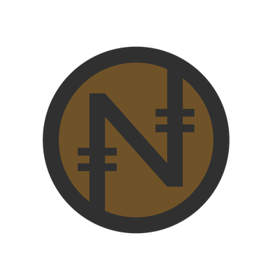

# noincoin (Block Chain in C Major)

**A rough cryptocurrency implementation written in C. Uses only C std library and nanomsg for communication.**

Nodes can mine noins(notecoins) which can be used to buy musical 'notes' on the blockchain. Each block contains eight notes (one octave) and together they comprise an everlasting piece of music anyone can contribute to.

Client program can transfer noins to other accounts or post the muscial notes.

I wrote this just to learn how cryptocurencies work. It lacks the full robustness to support an absolutely massive scale. Potential improvements: Dynamic Difficulty of Proof Generation, Sequencer that requests blocks as needed.
